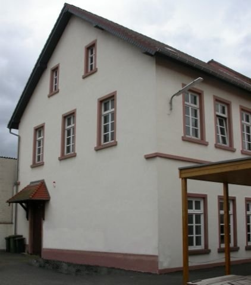

---
# You don't need to edit this file, it's empty on purpose.
# Edit theme's home layout instead if you wanna make some changes
# See: https://jekyllrb.com/docs/themes/#overriding-theme-defaults
layout: home
title: Willkommen
---

<!-- 
 -->

<strong>Nächste Termine</strong> 
  Ein Besuch der Archäologischen Schausammlung  
  ist nach Absprache möglich. 
Bitte nutzen Sie dazu unsere Kontakt-Emailadresse. 
  ----------  
 
20.02.2025  
Kelten in Nidderau? – Vortrag  
<a href="{{ site.url | relative_url }}/images/Pressemitteilung - VVFN e.V. - Nidderau - Kelten in Nidderau.pdf">Zum Vortrag</a>  
  ----------  
 
10.01.2025  
Taschenlampenführung  
<a href="{{ site.url | relative_url }}/images/Pressemitteilung - VVFN e.V. - Nidderau Taschenlampenfuehrung.pdf">Zur Taschenlampenführung</a>  
  ----------  
 
23.11.2024 bis 4.4.2025  
Replikenausstellung Keltenwelten  
<a href="{{ site.url | relative_url }}/images/Flyer Replikenausstellung VVFNeV_Stadt Nidderau 24_25.pdf">Flyer zum Ausdrucken</a>  
  ----------  
 
Besuchen Sie uns auch auf unserer <a href="https://www.facebook.com/vorgeschichte.niddertal/">Facebook-Seite</a>  
oder auf <a href="https://www.instagram.com/vorgeschichte_niddertal/">Instagram.</a> 
Anmeldung zum Newsletter unter: 
 <a href="mailto:kontakt.vvfn@gmail.com">kontakt.vvfn@gmail.com</a> 
  ----------  
 
  &emsp; 
  

&emsp; 
&emsp; 
Unser Buch "Reisen" ist weiterhin 
verfügbar! 
Näheres hier: <a href="https://vvfn.github.io/vvfn/aktuell/2022/01/28/PM-keltenjahr.html">Reisen</a> 
                   

<!--Vom Nidderauer Rathaus aus fahren Sie Richtung Friedberg immer geradeaus, im Stadtteil Heldenbergen nach dem Wolle-Laden rechts in die Mittelstraße, nach etwa 100 Metern biegen Sie links in die Hofeinfahrt auf das Gelände „Mittelburg“. Vor dem Archivgebäude stehen drei Parkplätze zur Verfügung. Weitere Parkplätze befinden sich am „Hessischen Hof“, von dort führt eine Treppe hinunter auf das Mittelburg-Gelände.
Zu Fuß gehen Sie an der Nidder entlang nach Heldenbergen, durch die Mühlstraße, unterhalb des Schlosses der Familie Leonhardi vorbei und immer geradeaus über die Bahnhofstraße in die Untergasse. Von dort führt ein Fußweg hinter einem Friseurgeschäft links auf das Mittelburggelände. 
**Mittelburggelände unterhalb „Hessischer Hof“**  

-->
